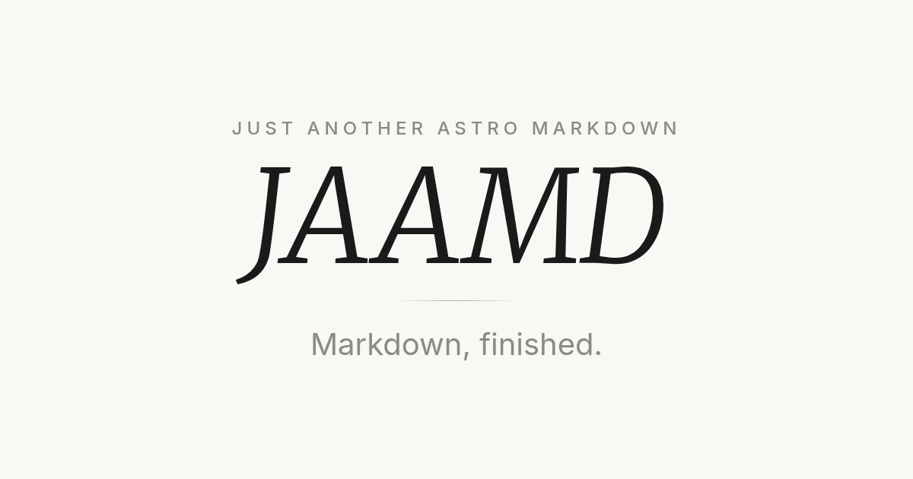

<p align="center">
  <a href="https://jaamd.lancher.dev">
    
  </a>
</p>

<p align="center">
  Remark plugins, client-side enhancements and styles as a single <a href="https://astro.build">Astro</a> integration for Markdown content.
</p>

<div align="center">

[](https://github.com/lancher-dev/jaamd/actions/workflows/ci.yml)
[](/LICENSE)
[](https://badge.fury.io/js/@lancher-dev%2Fjaamd)

</div>

```bash
npx astro add @lancher-dev/jaamd
```

```astro
---
import MarkdownContent from "@lancher-dev/jaamd/components";
---
<MarkdownContent>
  <slot />
</MarkdownContent>
```

Showcase: [jaamd.lancher.dev](https://jaamd.lancher.dev)

## Repository

| Path | What |
|---|---|
| [`packages/jaamd`](/packages/jaamd) | The integration, and its [documentation](/packages/jaamd/README.md) |
| [`www`](/www) | The showcase, itself rendered with jaamd |
| [`tests`](/tests) | Slug parity and post-build assertions |

```bash
pnpm install
pnpm dev            # the showcase, on localhost:4321
pnpm build && pnpm smoke
```

## License

jaamd is released under the [MIT License](/LICENSE).
